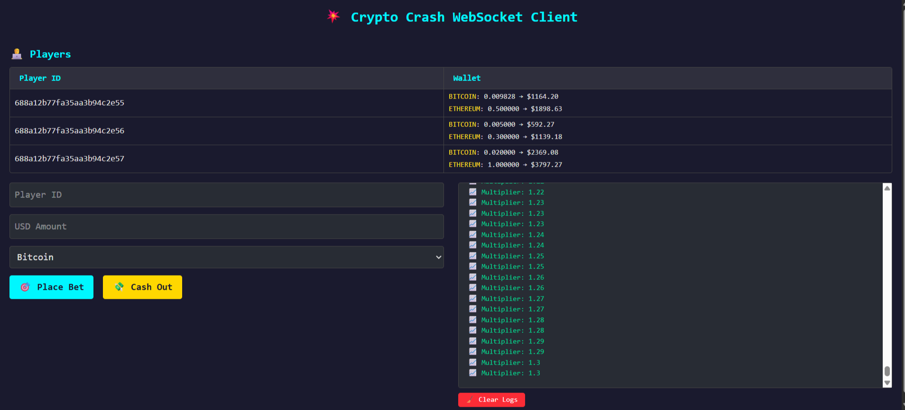

# 💥 Crypto Crash Game

A real-time multiplayer crash betting game using cryptocurrency values and WebSockets.

## 🚀 Live Demo

- **Frontend**: [https://crypto-crash-frontend-ochre.vercel.app](https://crypto-crash-frontend-ochre.vercel.app)
- **Backend**: [https://cryptocrashbackend-abj0.onrender.com](https://cryptocrashbackend-abj0.onrender.com)

## 🧠 Tech Stack

### Frontend
- React.js
- Tailwind CSS
- Socket.IO Client

### Backend
- Node.js
- Express.js
- MongoDB (Mongoose)
- Socket.IO
- CoinMarketCap API for live prices
- JWT (optional if extended)

## 📦 Features

- 🧑‍💻 Player wallet management
- 🎯 Real-time betting with live multiplier
- 💸 Live cash-out logic
- 💥 Game crash logic
- 📈 Live price fetching from CoinMarketCap
- 🔐 Secure API with CORS and error handling
- 📡 Real-time logs via WebSocket

## 📁 Folder Structure

```
Crypto-Crash_Game/
│
├── backend/
│   ├── models/
│   ├── routes/
│   ├── services/
│   ├── controllers/
│   └── server.js
│
├── frontend/
│   ├── src/
│   │   ├── components/
│   │   ├── App.jsx
│   │   └── main.jsx
│   └── vite.config.js
```

## 🔧 Setup Instructions

### Backend

1. Navigate to `backend/`:
    ```bash
    cd backend
    ```

2. Install dependencies:
    ```bash
    npm install
    ```

3. Create a `.env` file:
    ```ini
    MONGO_URI=your_mongodb_url
    PORT=3000
    CMC_API_KEY=your_coinmarketcap_api_key
    ```

4. Run the server:
    ```bash
    node server.js
    ```

### Frontend

1. Navigate to `frontend/`:
    ```bash
    cd frontend
    ```

2. Install dependencies:
    ```bash
    npm install
    ```

3. Create a `.env` file:
    ```ini
    VITE_BACKEND_URL=http://localhost:3000
    ```

4. Run the dev server:
    ```bash
    npm run dev
    ```

## 🧪 Sample Player Wallets (MongoDB)

```json
[
  { "username": "Alice", "wallet": { "bitcoin": 0.01, "ethereum": 0.5 } },
  { "username": "Bob", "wallet": { "bitcoin": 0.005, "ethereum": 0.3 } },
  { "username": "Charlie", "wallet": { "bitcoin": 0.02, "ethereum": 1.0 } }
]
```

## 📷 Preview



## 🛠 Future Improvements

- Authentication system
- Admin dashboard
- Betting history per user
- Currency selector with dropdown

## 👨‍💻 Author

**Shivam Tanwar**
